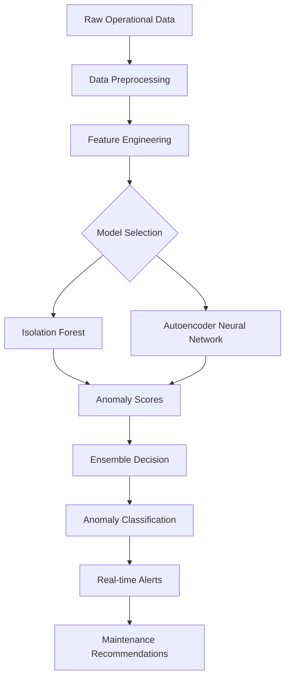
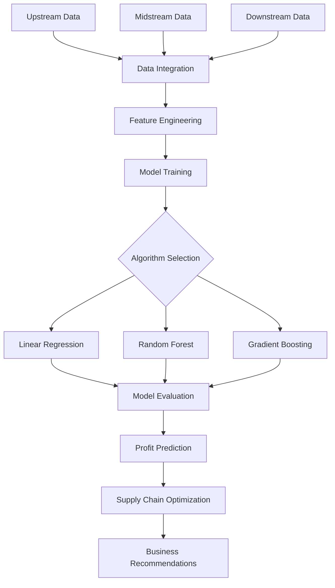
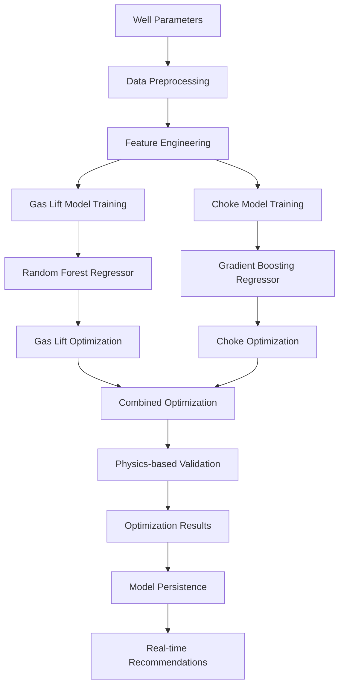
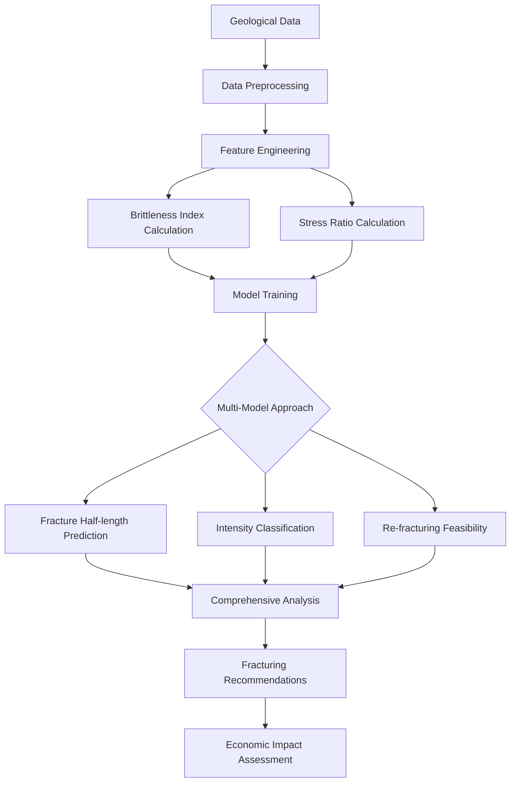
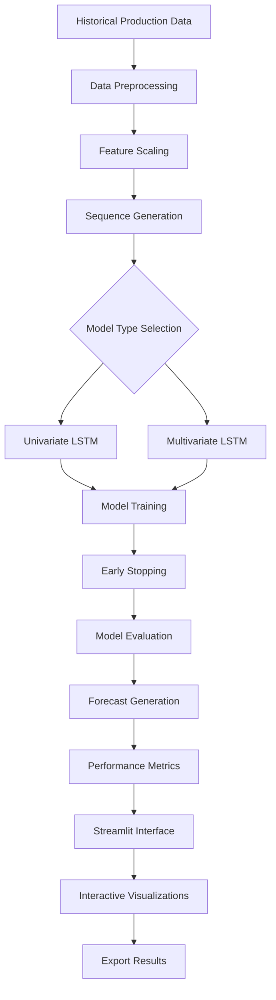
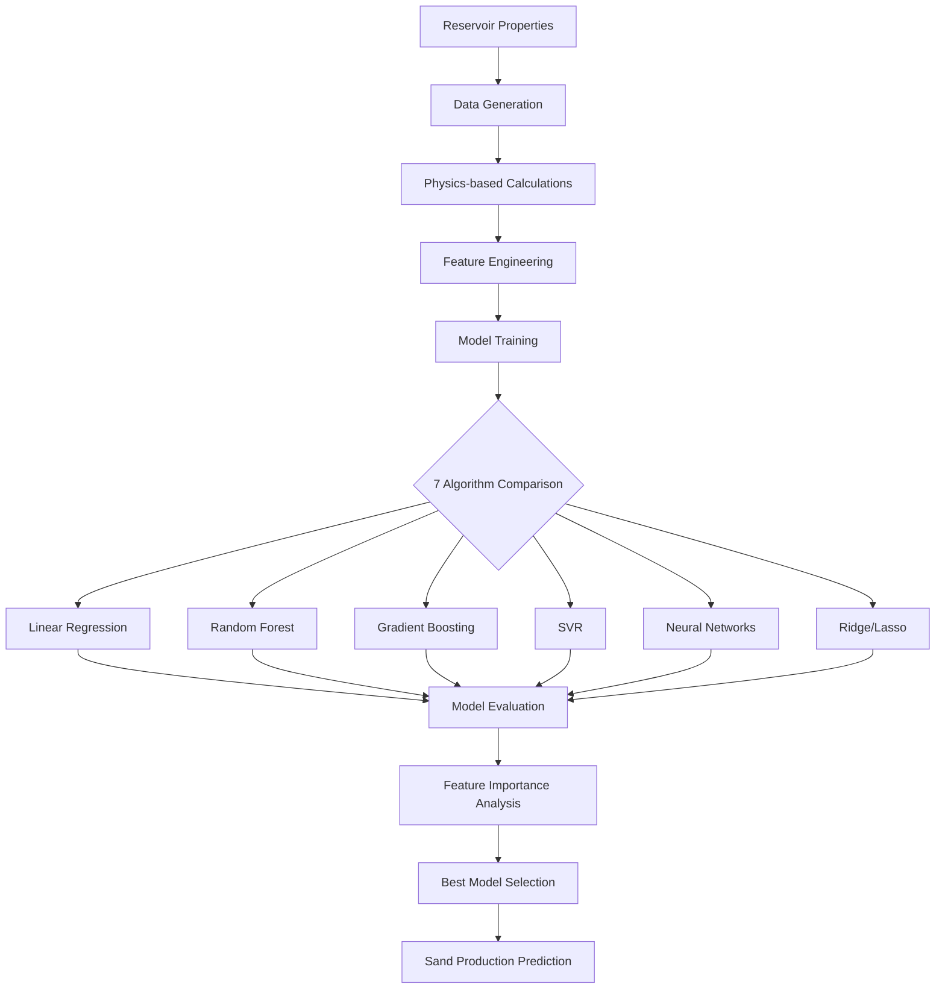
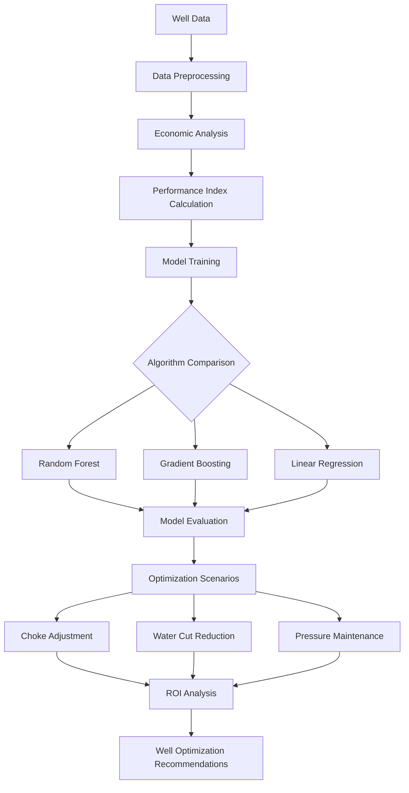
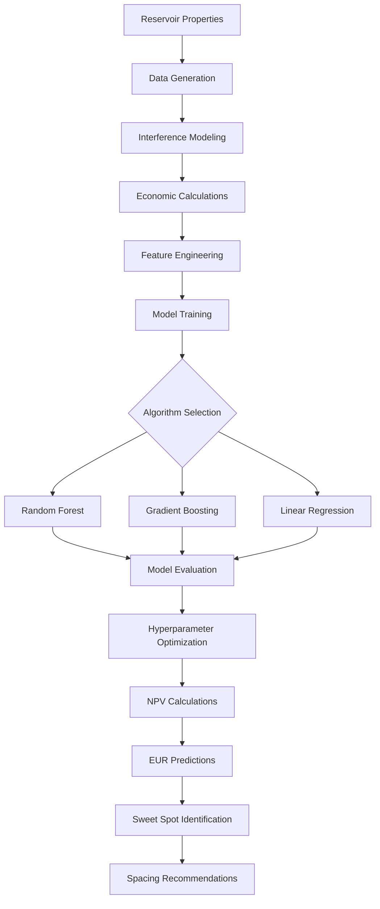

# PetroAI-Suite 🛢️🤖

<p align="center">
  
</p>

[](https://www.python.org/)
[](https://tensorflow.org/)
[](https://scikit-learn.org/)
[](https://streamlit.io/)
[](https://opensource.org/licenses/Apache-2.0)
[](https://github.com/jaiyesh/PetroAI-Suite)
[](https://github.com/jaiyesh/PetroAI-Suite/fork)
[](https://buymeacoffee.com/jaiyeshchahar)

A comprehensive collection of **8 machine learning projects** specifically designed for the oil and gas industry, covering upstream, midstream, and downstream operations with advanced ML techniques and petroleum engineering principles.

## 📋 Table of Contents

- [Overview](#overview)
- [Technology Stack](#technology-stack)
- [Project Architecture](#project-architecture)
- [Projects Overview](#projects-overview)
- [Installation](#installation)
- [Usage Guide](#usage-guide)
- [Project Flow Diagrams](#project-flow-diagrams)
- [Contributing](#contributing)
- [License](#license)

## 🔍 Overview

This repository contains sophisticated machine learning solutions addressing critical challenges in the petroleum industry:

- **Operational Optimization**: Maximize production efficiency and reduce costs
- **Risk Management**: Prevent equipment failures and operational hazards
- **Strategic Planning**: Optimize field development and resource allocation
- **Predictive Analytics**: Forecast production and identify trends
- **Economic Analysis**: ROI calculations and business impact assessment

## 🛠 Technology Stack

### Core Machine Learning Frameworks
- **TensorFlow/Keras**: Deep learning models (LSTM, Autoencoders)
- **Scikit-learn**: Traditional ML algorithms and preprocessing
- **NumPy**: Numerical computing and array operations
- **Pandas**: Data manipulation and analysis

### Visualization & UI
- **Matplotlib**: Static plotting and visualization
- **Seaborn**: Statistical data visualization
- **Plotly**: Interactive visualizations
- **Streamlit**: Web-based user interfaces

### Data Management
- **JSON**: Configuration and metadata storage
- **CSV**: Data persistence and exchange
- **Pickle**: Model serialization and storage

### Development Tools
- **Python 3.8+**: Programming language
- **Jupyter Notebooks**: Interactive development
- **Object-Oriented Programming**: Modular design patterns

## 🏗 Project Architecture

```
projects/
├── anomaly_detection/          # Operational anomaly detection
├── capstone_project/          # Complete supply chain optimization
├── gas_lift_optimization/     # Artificial lift optimization
├── hydraulic_fracture/        # Fracturing operations optimization
├── production_forecasting/    # Production prediction models
├── sand_production/          # Sand production prevention
├── well_optimization/        # Well performance optimization
├── well_spacing/            # Infill drilling optimization
└── README.md               # This file
```

## 📊 Projects Overview

### 1. 🚨 Anomaly Detection
**Purpose**: Detect unusual operational conditions to prevent equipment failures

**Key Features**:
- Isolation Forest and Autoencoder ensemble
- Real-time anomaly detection with confidence levels
- Physics-based synthetic data generation
- Equipment failure, reservoir issues, and extreme condition detection

**Technology**: TensorFlow, Scikit-learn, Matplotlib

---

### 2. 🏗 Capstone Project
**Purpose**: Integrated oil & gas supply chain optimization

**Key Features**:
- End-to-end supply chain analysis (upstream/midstream/downstream)
- Profit per barrel prediction
- Economic impact assessment
- Seasonal trend analysis

**Technology**: Scikit-learn, Advanced ensemble methods

---

### 3. ⛽ Gas Lift Optimization
**Purpose**: Optimize artificial lift operations for maximum production

**Key Features**:
- Dual optimization system (gas lift + choke)
- Physics-based calculations using petroleum correlations
- Real-time optimization recommendations
- Model persistence and versioning

**Technology**: Random Forest, Gradient Boosting, Professional visualization

---

### 4. 💥 Hydraulic Fracturing
**Purpose**: Optimize fracturing operations for unconventional wells

**Key Features**:
- Fracture half-length optimization
- Intensity classification (Low/Medium/High)
- Re-fracturing feasibility assessment
- Brittleness index and stress calculations

**Technology**: Multi-model ensemble, Geological parameter modeling

---

### 5. 📈 Production Forecasting
**Purpose**: Advanced production forecasting using deep learning

**Key Features**:
- LSTM neural networks for time series forecasting
- Univariate and multivariate approaches
- Interactive Streamlit web interface
- Model performance assessment with multiple metrics

**Technology**: TensorFlow/Keras, Streamlit, Plotly

---

### 6. 🏖 Sand Production
**Purpose**: Predict sand production rates to prevent equipment damage

**Key Features**:
- 7 ML algorithms comparison
- Physics-based synthetic data using Veeken correlations
- Feature importance analysis
- Automated model selection

**Technology**: Scikit-learn ensemble, Petroleum engineering correlations

---

### 7. 🔧 Well Optimization
**Purpose**: Comprehensive well performance optimization

**Key Features**:
- Multiple well analysis and comparison
- Economic analysis and profitability assessment
- Field development strategy optimization
- 9-panel EDA dashboard

**Technology**: Object-oriented design, Economic impact calculations

---

### 8. 📏 Well Spacing
**Purpose**: Optimize well spacing for infill drilling operations

**Key Features**:
- Well interference modeling
- Economic optimization (NPV and EUR)
- Sweet spot identification
- 12-panel comprehensive visualization

**Technology**: Advanced data generation, Business intelligence reporting

## 📦 Installation

### Prerequisites
```bash
Python 3.8 or higher
pip (Python package manager)
```

### Required Libraries
```bash
pip install numpy pandas scikit-learn matplotlib seaborn
pip install tensorflow keras plotly streamlit
pip install jupyter notebook
```

### Alternative Installation (using requirements.txt)
```bash
# Create requirements.txt with all dependencies
pip install -r requirements.txt
```

## 🚀 Usage Guide

### Running Individual Projects

1. **Navigate to project directory**:
```bash
cd "anomaly detection"  # or any other project
```

2. **Run the main script**:
```bash
python petroleum_anomaly_detection.py
```

3. **For Streamlit applications** (Production Forecasting):
```bash
streamlit run forecasting.py
```

### Project-Specific Instructions

#### Gas Lift Optimization
```bash
cd gas_lift_optimization
python gas_lift_choke_optimization.py
# Check petroleum_optimization_data/ for results
```

#### Well Optimization
```bash
cd "well optimization"
python well_optimization_project.py
# Multiple datasets available: standard, tight oil, mature field
```

#### Production Forecasting
```bash
cd production_forecasting
streamlit run forecasting.py
# Access web interface at http://localhost:8501
```

## 📊 Project Flow Diagrams

### 1. Anomaly Detection Flow


### 2. Capstone Project Flow


### 3. Gas Lift Optimization Flow


### 4. Hydraulic Fracturing Flow


### 5. Production Forecasting Flow


### 6. Sand Production Flow


### 7. Well Optimization Flow


### 8. Well Spacing Flow


## 🎯 Key Benefits

### Technical Benefits
- **Physics-informed ML**: All models integrate petroleum engineering principles
- **Comprehensive evaluation**: Multiple metrics and cross-validation
- **Professional visualization**: Business-ready dashboards and reports
- **Model persistence**: Reproducible results and version control

### Business Value
- **Cost Reduction**: Optimize operations and reduce waste
- **Risk Mitigation**: Early detection of equipment failures
- **Production Maximization**: Data-driven parameter optimization
- **Strategic Planning**: Field development and resource allocation
- **ROI Quantification**: Economic impact assessment

## 📈 Performance Metrics

Each project includes comprehensive performance evaluation:

- **Regression Tasks**: R², RMSE, MAE, MAPE
- **Classification Tasks**: Accuracy, Precision, Recall, F1-score
- **Time Series**: Directional accuracy, forecast bias
- **Economic Metrics**: NPV, ROI, payback period

## 🔮 Future Enhancements

- **Real-time Data Integration**: Live data feeds and streaming analytics
- **Cloud Deployment**: Scalable cloud-based solutions
- **Advanced Visualization**: 3D visualizations and interactive dashboards
- **Integration APIs**: RESTful APIs for system integration
- **Mobile Applications**: Field-ready mobile interfaces

## 🤝 Contributing

We welcome contributions! Please follow these guidelines:

1. Fork the repository
2. Create a feature branch
3. Add comprehensive tests
4. Update documentation
5. Submit a pull request

## 🤝 Contributions

Contributions are welcome! Please open issues or submit pull requests for improvements, new features, or bug fixes.

---

## ⚖️ License

This project is licensed under the **Apache-2.0 License**. See the [LICENSE](LICENSE) file for details.

---

## 📬 Contact

For questions or collaboration, reach out to:
- **Jaiyesh Chahar** - [LinkedIn](https://www.linkedin.com/in/jaiyesh-chahar-9b3642107/) - [GitHub](https://github.com/jaiyesh)

---

## 📝 Citation

If you use PetroAI-Suite in your research or work, please cite:

```
@misc{Chahar2025,
  Author = {Jaiyesh Chahar},
  Title = {PetroAI-Suite: Comprehensive AI Solutions for Oil & Gas Industry},
  Year = {2025},
  Publisher = {GitHub},
  Journal = {GitHub repository},
  Howpublished = {\url{https://github.com/jaiyesh/PetroAI-Suite}}
}
```

---

## ☕ Support

If you like this project and want to support its development, you can <a href="https://buymeacoffee.com/jaiyeshchahar" target="_blank"></a>

<p align="right">
  <a href="#top"><b>🔝 Return </b></a>
</p>

---

**Note**: This repository contains educational and research-focused implementations. For production use, additional validation and testing are recommended.

## 🔗 Quick Navigation

| Project | Main Script | Data Files | Documentation |
|---------|-------------|------------|---------------|
| [Anomaly Detection](./anomaly%20detection/) | `petroleum_anomaly_detection.py` | Synthetic data | `teaching_study_plan.md` |
| [Capstone Project](./capstone_project/) | `oil_gas_capstone.py` | Integrated supply chain | - |
| [Gas Lift Optimization](./gas_lift_optimization/) | `gas_lift_choke_optimization.py` | `petroleum_optimization_data/` | `petroleum_ml_lecture_plan.md` |
| [Hydraulic Fracturing](./hydraulic_fracture/) | `frac_optimization_project.py` | Synthetic geological data | `teaching_plan_script.md` |
| [Production Forecasting](./production_forecasting/) | `forecasting.py` | Time series data | - |
| [Sand Production](./sand_production/) | `sand_production_ml.py` | `sand_production_data.csv` | `sand_production.md` |
| [Well Optimization](./well%20optimization/) | `well_optimization_project.py` | Multiple CSV datasets | `well_optimization_guide.md` |
| [Well Spacing](./well_spacing/) | `well_spacing_ml_project.py` | Synthetic spacing data | `teaching_plan_well_spacing.md` |

Ready to explore the intersection of machine learning and petroleum engineering! 🚀